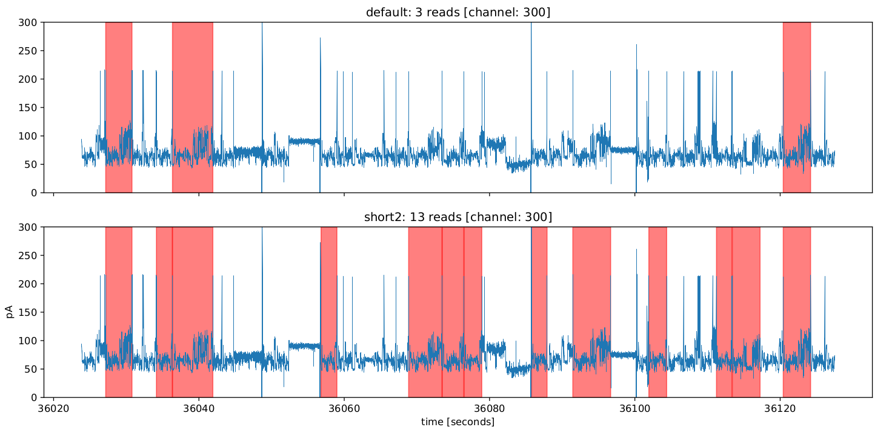
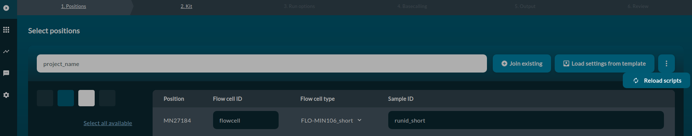
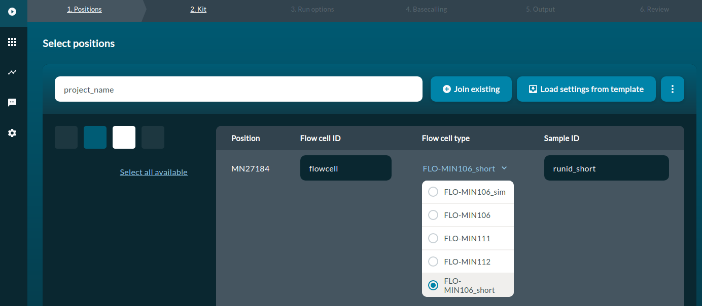
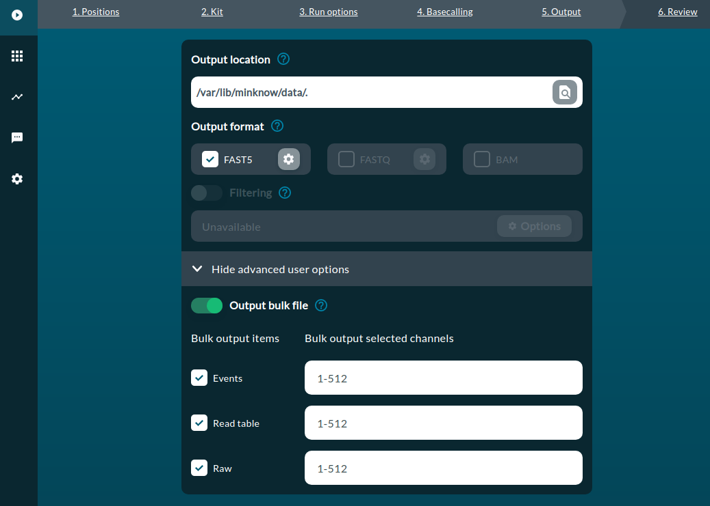

# MinKNOW alternative configurations

The default MinKNOW configuration is suboptimal in detecting reads
originating from short molecules such as tRNA.
We optimised the configuration to capture ~10x more reads from tRNA experiments. 
Below, you can see the reads (in red) identified by **default** (top)
and our **custom** (bottom) configuration.




Here we describe how to set up alternative MinKNOW configurations
for enhanced capture of tRNA reads from direct RNA nanopore sequencing runs,
which are otherwise discarded when using default MinKNOW settings. 


## Setting up alternative MinKNOW configurations
To enable those, simply rsync conf files (root priviledges needed):

```bash
rsync -a conf/package/flow_cells.toml /opt/ont/minknow/conf/package
rsync -a conf/package/sequencing/*.toml /opt/ont/minknow/conf/package/sequencing
```

After, reloading scripts in MinKNOW



you should see alternative configurations in the flowcell type field



You can now run MinKNOW with alternative configurations (named "FLO-MIN106_short"),
which will allow you to capture short tRNAs during the sequencing run,
without having to save the bulk FAST5 file.

## How it works
Everytime the scripts are reloaded, MinKNOW reads configuration of:

* `flowcells.toml` -->  from `/opt/ont/minknow/conf/package/flow_cells.toml`
* `sequencing*.toml` --> from `/opt/ont/minknow/conf/package/sequencing/sequencing_*.toml`

Depending which flowcell is selected by the user and the experiment type,
MinKNOW will use a matching configuration file.
For example, if the user selects FLO-MIN106 and direct RNA sequencing kit,
MinKNOW will match it to sequencing_MIN106_RNA.toml. 

## MinKNOW versions required/tested 
The toml files that have been made available were generated
for MinKNOW version defined in the release information. 

You may need to tweak the `toml` files to make them suitable to your MinKNOW versions. 

# Troubleshooting

## Alternative configurations can't be used during sequencing

Note, currently the **custom configurations can be used only with sequencing simulations**. 
If you try to use them with real sequencing, it'll likely fail during QC step. 
In order to start simulation from bulk file, you'll need to:

1. run your sequencing saving bulk file  
Here, make sure you have lots of free space.
Bulk file for 72h dRNAseq run from MinION may reach 250-300 GB.
Of course, you'll need additional space for the Fast5 files.



2. specify bulk file in the configuration file under `custom_settings`  
The `custom_settings` part of your configuration file
`/opt/ont/minknow/conf/package/sequencing/sequencing_MIN106_RNA_short.toml`
should look something like this: 

```bash
###############################
# Sequencing Feature Settings #
###############################

# basic_settings #
[custom_settings]
enable_relative_unblock_voltage = true
unblock_voltage_gap = 480
run_time = 7200 #172800 # (seconds) 1hr=3600
start_bias_voltage = -180
# UI parameters
translocation_speed_min = 50
translocation_speed_max = 75
q_score_min = 7

simulation="/path/to/bulk_file.fast5"
```

3. and start sequencing simulation using `FLO-MIN106_short` flowcell (alternative cofiguration)


